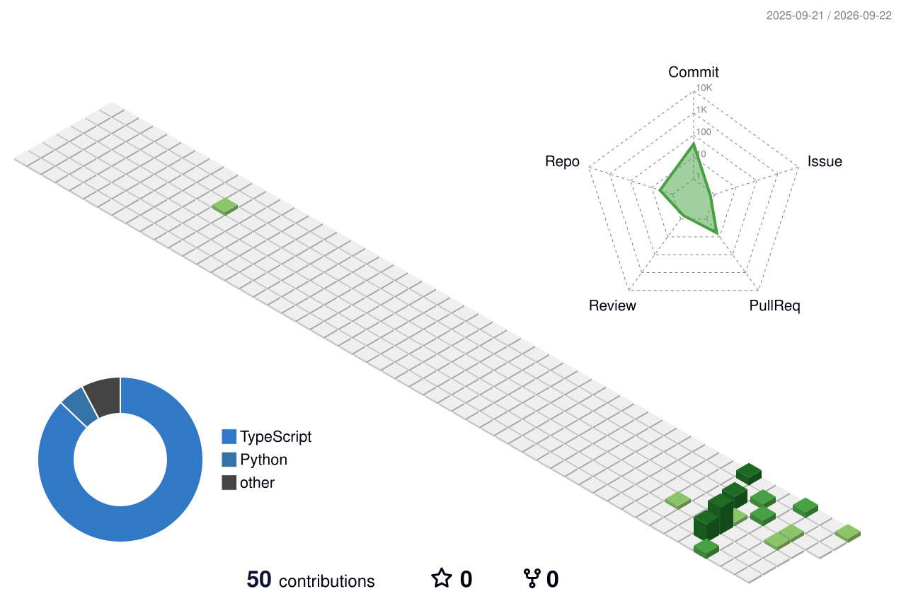

# ETHAN // KEROP11612-UI

### AI • Python • Web • Android

  
  
  

## About Me

Early-career developer building practical projects across Python, AI / LLM experiments, data analysis, web, and Android development.

- Learning by building small, useful tools
- Exploring Japanese learning experiences
- Growing a public portfolio one project at a time

## Tech Stack

  

## Featured Projects

### KikuLoop

Android Japanese podcast and learning tool focused on listening, transcripts, and practical study workflows.

- **Tech Stack:** Kotlin · Android · Podcast · Transcript · Japanese Learning
- **Repository:** Not published yet

### [n4-kotoba-demo](https://github.com/kerop11612-ui/n4-kotoba-demo)

Japanese N4 vocabulary learning website for practicing words through a focused web experience.

- **Tech Stack:** Next.js · TypeScript · Japanese Learning · Web
- **Repository:** [View on GitHub](https://github.com/kerop11612-ui/n4-kotoba-demo)

## 3D Contribution Graph

  <picture>
    <source media="(prefers-color-scheme: dark)" srcset="./profile-3d-contrib/profile-night-green.svg" />
    <source media="(prefers-color-scheme: light)" srcset="./profile-3d-contrib/profile-green.svg" />
    
  </picture>

## Contribution Snake

  <picture>
    <source media="(prefers-color-scheme: dark)" srcset="https://raw.githubusercontent.com/kerop11612-ui/kerop11612-ui/output/github-snake-dark.svg" />
    <source media="(prefers-color-scheme: light)" srcset="https://raw.githubusercontent.com/kerop11612-ui/kerop11612-ui/output/github-snake.svg" />
    
  </picture>

## GitHub Metrics

  

Learning in public · Building one project at a time.

